# Yellow River Delta: Land Cover Change Detection (2018–2024)

> Satellite embedding-based change analysis of the Yellow River Delta (Shandong Province, China)
> using Google Earth Engine, Google Satellite Embeddings V1 (64-band, 10m), and Dynamic World land cover.

---

## Why 2018–2024?

The period 2018–2024 captures a critical window of environmental transition in the Yellow River Delta:

- **2019 — Yellow River Basin Ecological Protection Plan**: China launched major wetland restoration and flow regulation programs under the national "ecological civilization" policy, altering sediment flux and inundation regimes in the delta.
- **2020–2021 — Increased river discharge**: After years of reduced flow, water management interventions pushed more freshwater into the delta, expanding flooded vegetation and wetland extent.
- **Ongoing coastal dynamics**: Sediment starvation (upstream dams trap >90% of Yellow River sediment) drives shoreline retreat in inactive lobes while new land accretes near the active river mouth — producing competing signals of gain and loss detectable in 6-year multi-temporal analysis.
- **Agricultural and urban pressure**: Rapid expansion of aquaculture ponds and built infrastructure along the Bohai Sea coast is directly visible in the embedding-based change signal.

This 6-year window is long enough to capture land cover transitions driven by policy, hydrology, and land use change, while remaining within the temporal coverage of Google Satellite Embeddings V1.

---

## Study Area

**Yellow River Delta** — Dongying, Shandong Province, China
Bounding box (WGS84): `118.35–119.35°E`, `37.35–38.15°N`

One of the most dynamically evolving deltas in the world. The Yellow River historically carried the world's highest sediment load, but upstream damming has reduced it by >90% since the 1980s, producing a delta in geomorphic transition — net erosion on inactive lobes, accretion at the active river mouth, and expanding wetlands driven by flow restoration policies.

---

## Methodology

Six-part R pipeline using Google Earth Engine as the remote sensing data source.

```
Part 1  →  Export Dynamic World land cover classification (2018 & 2024)
Part 2  →  Change detection: MAD + Cosine dissimilarity on 64-band embeddings
Part 3A →  Export Google Satellite Embeddings V1 (64 bands, 10m) from GEE
Part 3B →  Unsupervised K-means clustering of embedding space (K = 3, 5, 10)
Part 4  →  Supervised classification: Linear Probe (ridge) + Random Forest
Part 5  →  Extreme precipitation frequency maps (ERA5, P95 threshold)
Part 6  →  Bivariate overlay: precipitation extremes × change hotspots
```

### Data Sources

| Dataset | Resolution | Source |
|---|---|---|
| Google Satellite Embeddings V1 | 10 m, 64 bands | Google Earth Engine |
| Google Dynamic World V1 | 10 m, 9 classes | Google Earth Engine |
| ERA5 Extreme Precipitation (P95) | ~30 km | Copernicus / GEE |

### Change Detection Metrics

Two complementary pixel-wise metrics computed across the 64-dimensional embedding space:

| Metric | Formula | Sensitivity |
|---|---|---|
| **MAD** (Mean Absolute Difference) | mean(\|e₂₀₂₄ − e₂₀₁₈\|) | Magnitude of change |
| **Cosine Change** | 1 − cos(e₂₀₁₈, e₂₀₂₄) | Directional shift in spectral signature |

Using both together distinguishes areas of high-magnitude change (MAD) from areas where the spectral *character* of land cover shifted even at low amplitude (cosine).

---

## Classification Performance

Models trained on 2024 embeddings (64 bands) with Dynamic World labels as targets.
Train/test split: 80/20, sample size: 15,000 pixels, random seed: 42.

### Overall Accuracy

| Model | Overall Accuracy | Macro-F1 |
|---|---|---|
| **Random Forest** (300 trees) | **92.9%** | **0.498** |
| Linear Probe (ridge multinomial) | 92.0% | 0.459 |

> **Note on macro-F1**: The gap between high OA and moderate macro-F1 reflects class imbalance.
> Crops dominate the sample (n=2,046), while rare classes like Flooded vegetation (n=33),
> Shrub & scrub (n=4), and Bare ground (n=28) are too sparse for the classifier to learn reliably.
> This is a known limitation of using Dynamic World mode as a label source in heterogeneous deltas.

### Per-Class Performance (Random Forest)

| Class | Precision | Recall | F1 | Support |
|---|---|---|---|---|
| Crops | 0.934 | 0.977 | **0.955** | 2046 |
| Water | 0.930 | 0.939 | **0.935** | 526 |
| Built area | 0.911 | 0.879 | **0.895** | 290 |
| Trees | 0.809 | 0.521 | 0.633 | 73 |
| Flooded vegetation | — | 0.000 | 0.000 | 33 |
| Bare ground | 1.000 | 0.036 | 0.069 | 28 |
| Shrub & scrub | — | 0.000 | 0.000 | 4 |

---

## Area Change Statistics (Dynamic World, km²)

| Land Cover Class | Area 2018 (km²) | Area 2024 (km²) | Change (km²) |
|---|---|---|---|
| Water | 4,257.3 | 4,382.9 | **+125.6** |
| Crops | 2,300.6 | 2,170.0 | **−130.5** |
| Built area | 673.8 | 765.9 | **+92.1** |
| Bare ground | 407.7 | 309.8 | **−97.9** |
| Flooded vegetation | 69.4 | 86.3 | **+16.8** |
| Trees | 74.0 | 60.4 | −13.5 |
| Shrub & scrub | 37.6 | 47.0 | +9.4 |

Key signals: water extent grew (+125 km²) and cropland shrank (−130 km²), consistent with wetland expansion from flow restoration. Built area grew (+92 km²), driven by coastal infrastructure and aquaculture development.

---

## Key Figures

### Land Cover Change (2018 → 2024)

| Figure | Description |
|---|---|
| 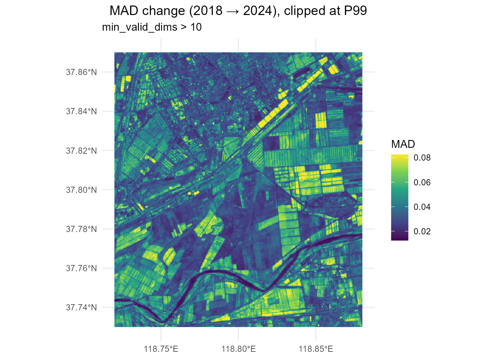 | MAD change map (clipped at P99) |
| 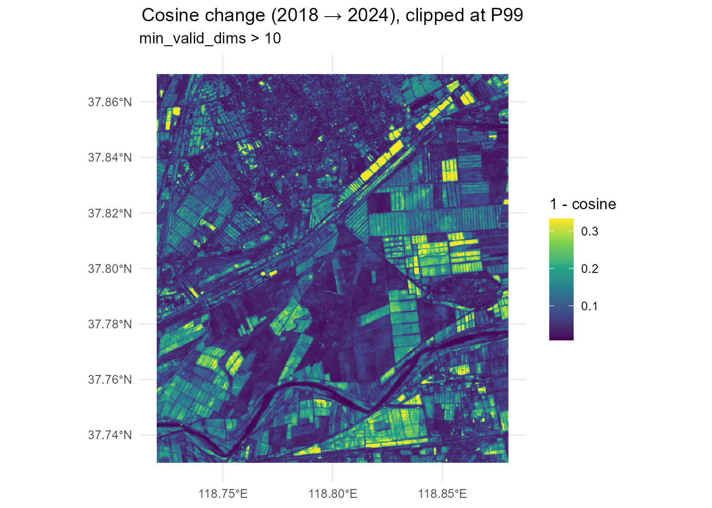 | Cosine change map (clipped at P99) |
| 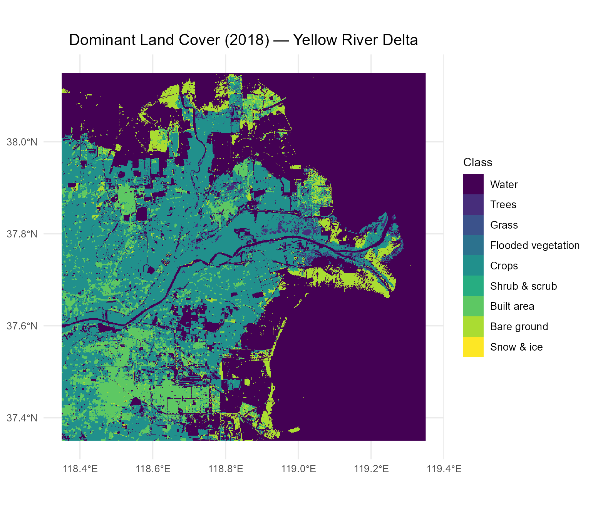 | Dynamic World land cover 2018 |
| 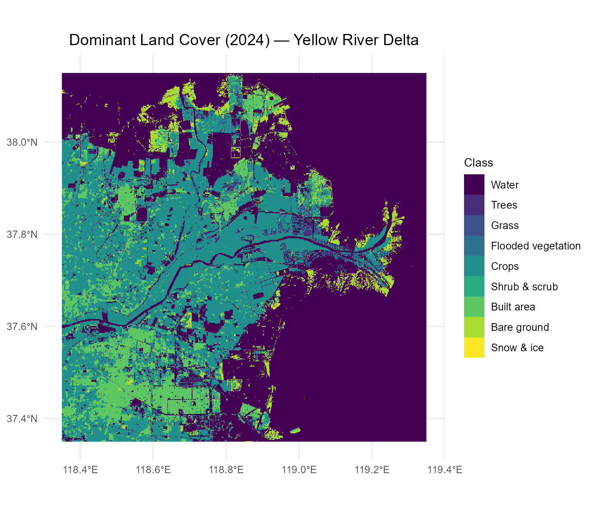 | Dynamic World land cover 2024 |
|  | Area change per class |

### Unsupervised Clustering (2024 Embeddings)

| K | Figure |
|---|---|
| K = 3 | 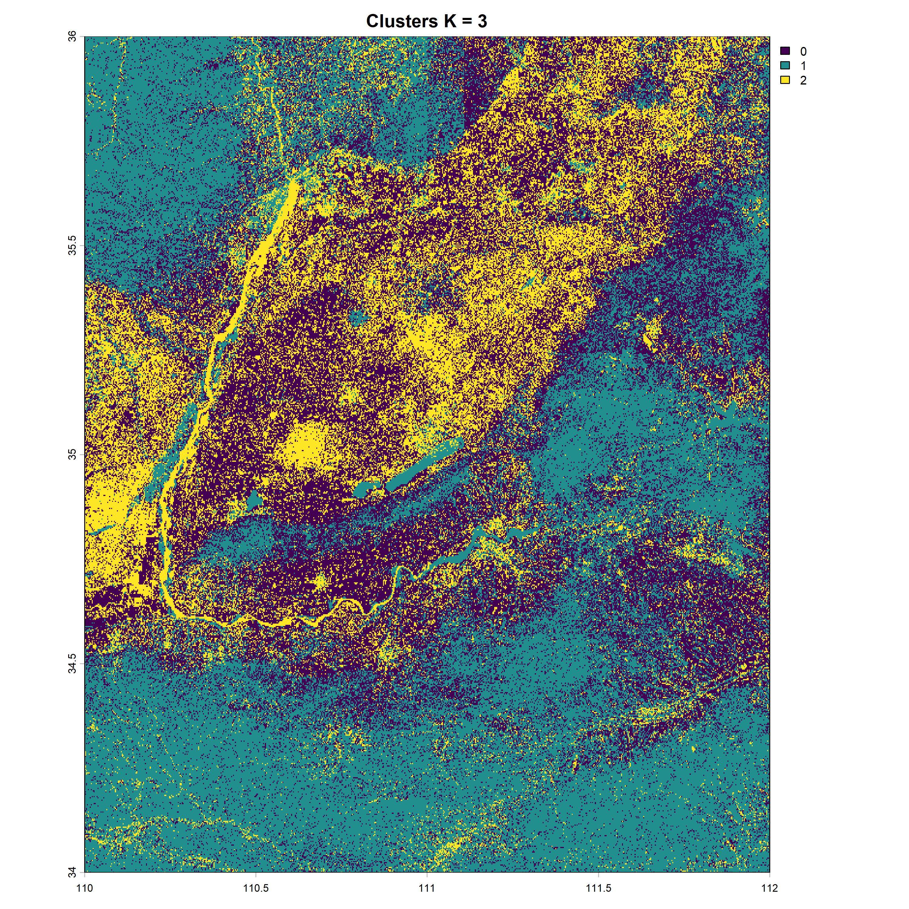 |
| K = 5 | 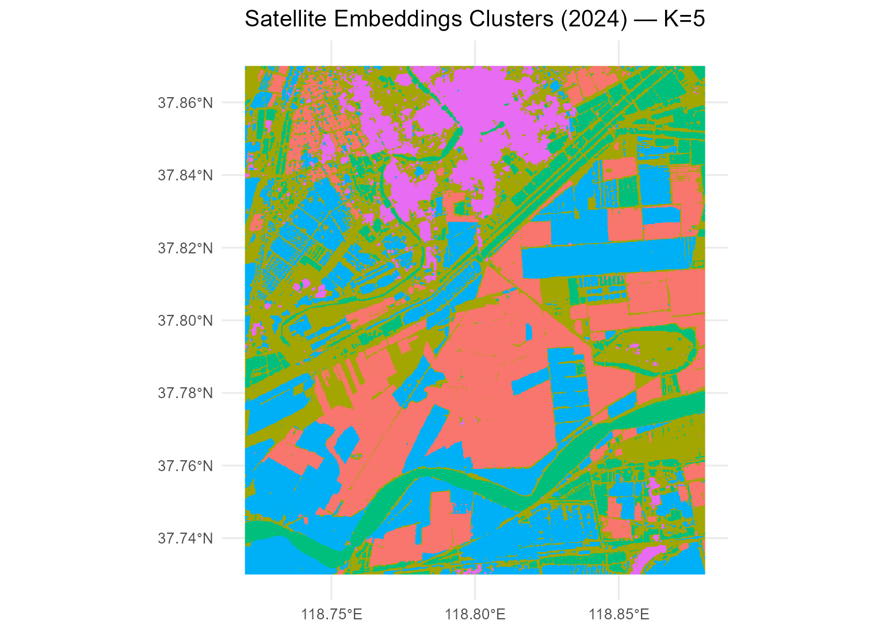 |
| K = 10 | 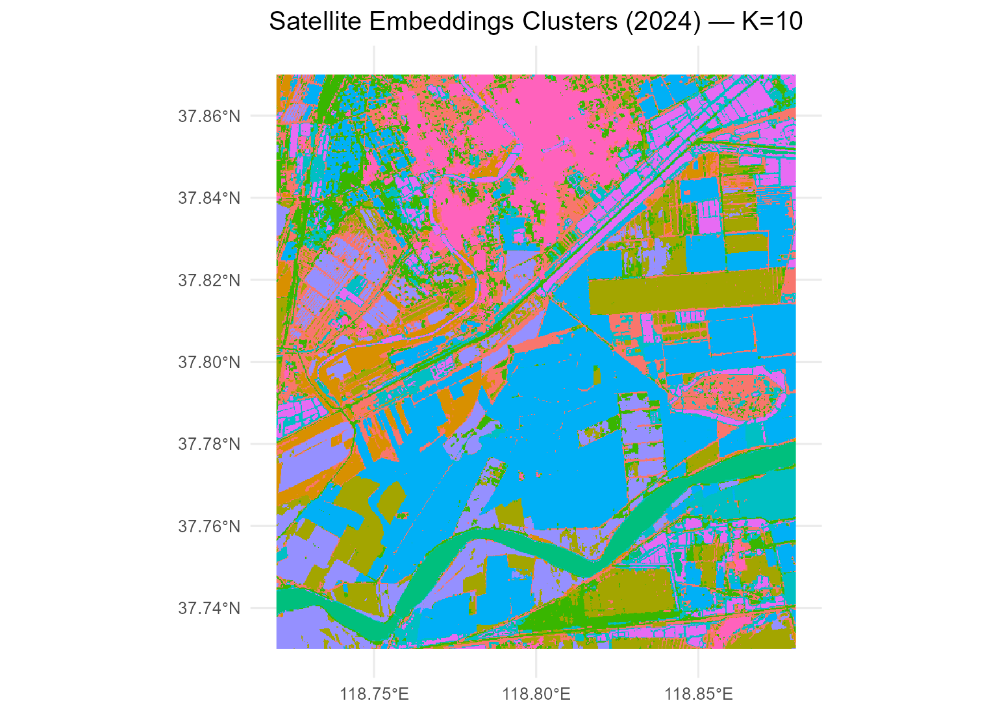 |

### Classification (Random Forest)

| Figure | Description |
|---|---|
| 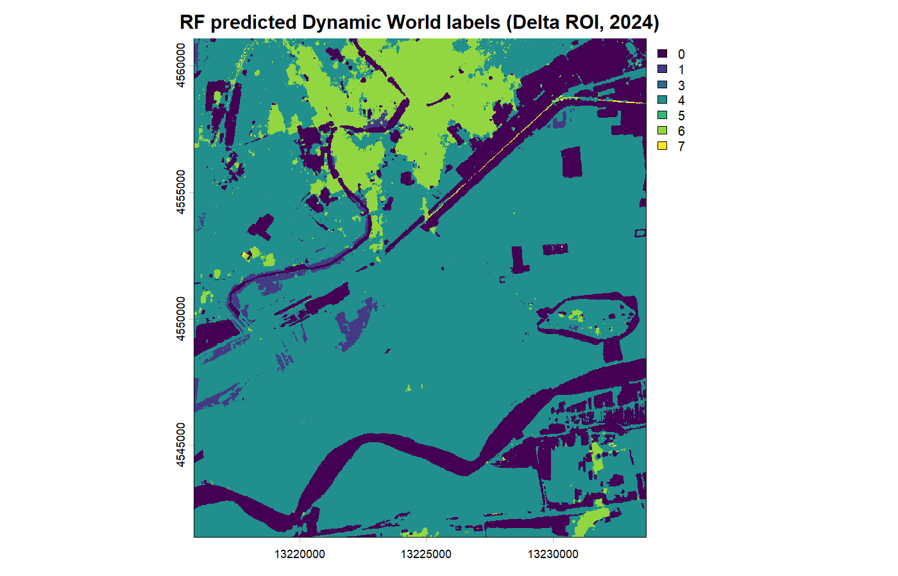 | RF land cover prediction (2024) |
|  | Normalized confusion matrix |
| 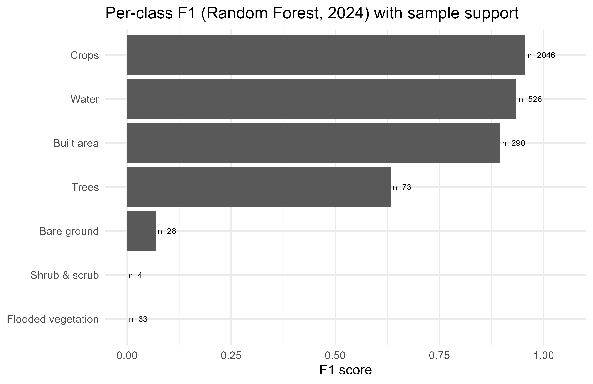 | Per-class F1 (RF) |
| 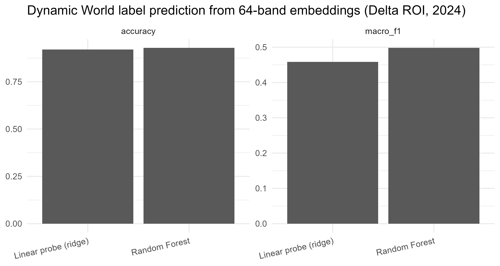 | Linear Probe vs. Random Forest |

### Precipitation × Change Overlay

| Figure | Description |
|---|---|
| 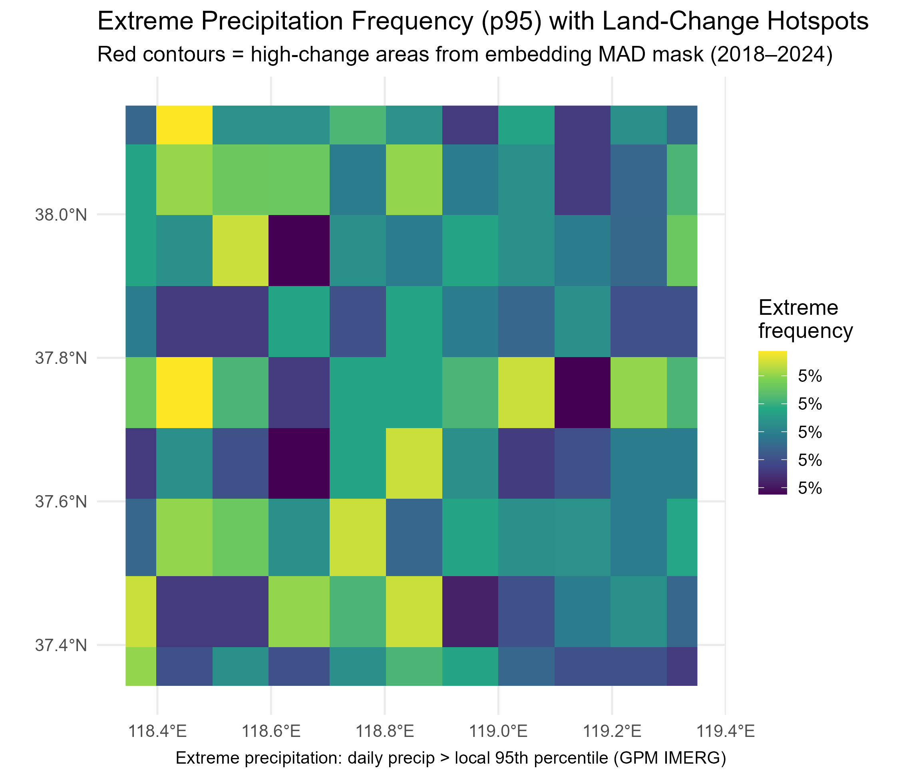 | Extreme precipitation vs. MAD hotspots |
|  | Precipitation at high-change pixels |

---

## Repository Structure

```
land_cover_gis/
├── Scripts/
│   ├── config.R                              # ← Start here: all paths and parameters
│   ├── part1_export_DW_delta.r               # Dynamic World export from GEE
│   ├── part2_change_detection_clean.r        # MAD + cosine change detection
│   ├── part3_embeddings_export_delta_ee.r    # Export 64-band embeddings from GEE
│   ├── part3_embeddings_analysis_delta.r     # K-means clustering
│   ├── part4_linear_probe_baseline_delta.r   # RF + linear probe classification
│   ├── part5_plot_extreme_precip.r           # ERA5 precipitation frequency maps
│   ├── part6_extreme_precip_vs_change_hotspots.r  # Bivariate overlay
│   ├── interactive_map_leaflet.R             # Interactive HTML map (all layers)
│   ├── publication_figures.R                 # Publication-quality maps with scale bars
│   └── QA_full_project.r                     # Quality assurance / validation
├── figures/
│   ├── embeddings_delta/                     # Delta change maps (MAD, cosine, clusters)
│   ├── linear_probe/                         # Classification figures
│   └── publication/                          # Scale-bar figures (from publication_figures.R)
│       ├── fig1_mad_change.png
│       ├── fig2_cosine_change.png
│       ├── fig3_dynamic_world_comparison.png
│       ├── fig4_summary_panel.png
│       └── fig5_bivariate_change_precip.png
└── results/
    ├── DW_area_change_stats.csv
    ├── area_stats/                            # K-means cluster areas (km²) per K
    └── linear_probe/                          # Model metrics, confusion matrix, weights
        ├── metrics_linear_vs_rf.csv
        ├── per_class_metrics_rf.csv
        ├── confusion_matrix_rf_normalized.csv
        └── top_linear_probe_weights.csv
```

> `data/` is not tracked — see Data Access below (~22 GB of GeoTIFFs).

---

## Quick Start

**Step 1: Edit `Scripts/config.R`** — set `PROJECT_ROOT` and `PYTHON_PATH` for your machine. This is the only file you need to edit.

**Step 2: Install R packages**

```r
install.packages(c(
  "terra", "ggplot2", "tidyterra", "ggspatial", "patchwork",
  "dplyr", "tidyr", "glmnet", "ranger", "reticulate",
  "leaflet", "leafem", "htmlwidgets", "scales", "sf"
))
```

**Step 3: Authenticate Google Earth Engine**

```bash
pip install earthengine-api
earthengine authenticate
```

**Step 4: Run scripts in order**

```r
source("Scripts/config.R")   # loads all settings
# Then run parts 1–6 in sequence (see Scripts/ folder)
```

**Step 5: Generate publication figures and interactive map**

```r
source("Scripts/publication_figures.R")  # figures/publication/
source("Scripts/interactive_map_leaflet.R")  # figures/interactive_map.html
```

---

## Data Access

Raw and processed raster data (~22 GB) are not tracked due to size. To reproduce:

1. Create a Google Earth Engine project
2. Run `Scripts/part1_export_DW_delta.r` → exports Dynamic World to Google Drive
3. Run `Scripts/part3_embeddings_export_delta_ee.r` → exports 64-band embeddings
4. Download outputs from Drive into `data/`

Key output rasters (change maps, cluster maps) are available on request.

---

## R Package Dependencies

| Package | Purpose |
|---|---|
| `terra` | Raster processing (crop, resample, mask, apply) |
| `ggplot2` + `tidyterra` | Spatial visualization |
| `ggspatial` | Scale bars and north arrows (publication maps) |
| `patchwork` | Multi-panel figure composition |
| `glmnet` | Linear probe (ridge multinomial classification) |
| `ranger` | Random Forest classification |
| `reticulate` | Python/Earth Engine bridge |
| `leaflet` + `leafem` | Interactive HTML map |

---

## GEE Configuration

Replace the project ID in `Scripts/config.R`:

```r
GEE_PROJECT <- "your-gee-project-id"
```

Create a project at [code.earthengine.google.com](https://code.earthengine.google.com).

---

## Region of Interest Coordinates (WGS84)

| ROI | Purpose | Lon (E) | Lat (N) |
|---|---|---|---|
| Primary | Dynamic World export | 118.35–119.35 | 37.35–38.15 |
| Secondary | Change detection (Henan tiles) | 118.55–119.45 | 37.35–38.10 |
| Smoke test | GEE export verification | 118.72–118.88 | 37.73–37.87 |

---


---

## Acknowledgements

- [Google Dynamic World](https://dynamicworld.app/) — near-real-time global land cover (10m)
- [Google Earth Engine](https://earthengine.google.com/) — cloud-based geospatial analysis platform
- [Google Satellite Embeddings V1](https://developers.google.com/earth-engine/datasets/catalog/GOOGLE_SATELLITE_EMBEDDING_V1) — foundation model embeddings for satellite imagery
