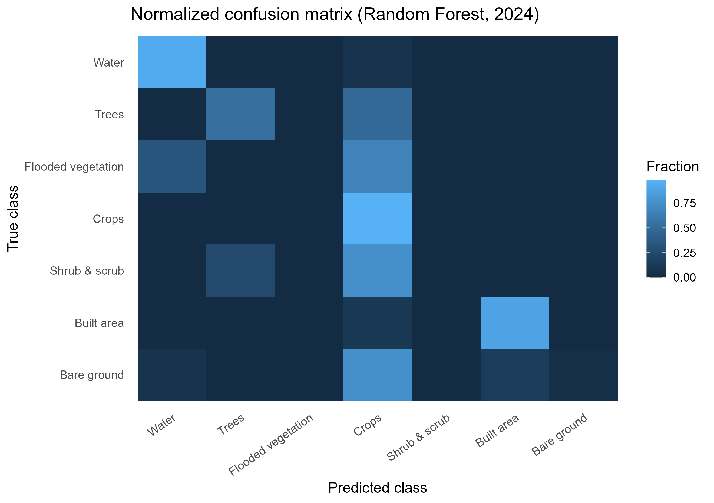
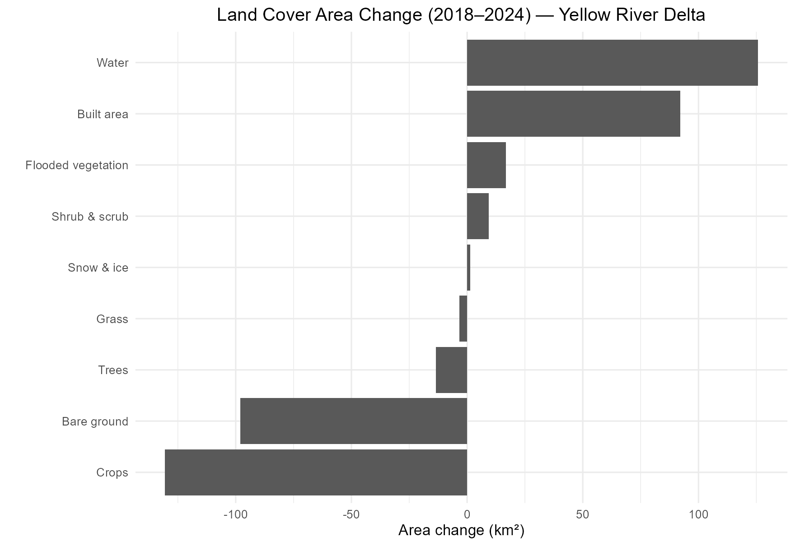
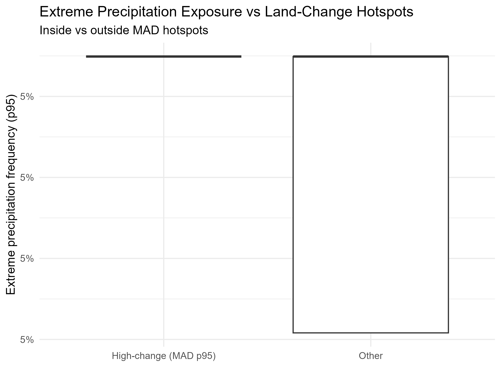

```{r setup, include=FALSE}
source("Scripts/config.R")
suppressPackageStartupMessages({
  library(ggplot2)
  library(dplyr)
  library(tidyr)
  library(knitr)
  library(scales)
})
```

# Introduction

The Yellow River Delta (YRD) in Shandong Province, China, is one of the world's most dynamically evolving coastal landforms. Historically carrying the highest sediment load of any river system, the Yellow River now delivers less than 10% of its pre-dam sediment to the sea — a consequence of extensive upstream damming — driving a delta in geomorphic transition: net erosion on abandoned lobes, active accretion at the current river mouth, and expanding inland wetlands responding to national flow restoration policies [@wang2017yellow].

The period **2018–2024** captures a critical window of environmental and policy change:

- The **2019 Yellow River Basin Ecological Protection Plan** launched mandatory wetland restoration targets and altered flow regulation regimes
- Increased freshwater delivery beginning 2020–2021 expanded flooded vegetation and open water extent
- Continued coastal infrastructure development for aquaculture and industry expanded impervious surfaces

This analysis uses **Google Satellite Embeddings V1** — 64-dimensional feature vectors derived from a satellite imagery foundation model — to detect and characterise land cover change across the delta at 10 m resolution, without relying on hand-crafted spectral indices.

## Study Area

The primary region of interest (ROI) covers the Yellow River Delta near Dongying:

| Parameter | Value |
|---|---|
| Longitude | 118.35–119.35°E |
| Latitude | 37.35–38.15°N |
| Area | ~8,800 km² |
| CRS | WGS84 (EPSG:4326) |

# Data and Methods

## Data Sources

```{r data-table, echo=FALSE}
data.frame(
  Dataset = c(
    "Google Satellite Embeddings V1",
    "Google Dynamic World V1",
    "ERA5 Precipitation (GPM IMERG)"
  ),
  Resolution = c("10 m, 64 bands", "10 m, 9 classes", "~30 km"),
  `Time Period` = c("2018, 2024", "2018, 2024", "2018–2024"),
  Source = c(
    "Google Earth Engine",
    "Google Earth Engine",
    "Copernicus / GEE"
  )
) |>
  kable(caption = "Summary of datasets used in this analysis.")
```

### Google Satellite Embeddings V1

The embedding layer is produced by a foundation model trained on global satellite imagery.
Each pixel is represented as a 64-dimensional float32 vector capturing learned spectral and
textural features at 10 m resolution. Unlike hand-crafted indices (NDVI, NDWI), these
embeddings encode complex multi-scale patterns without requiring explicit feature engineering.

### Google Dynamic World

Dynamic World provides near-real-time probabilistic land cover at 10 m resolution with 9 classes.
We use the annual **mode** composite for 2018 and 2024 to reduce within-year noise and cloud contamination.

## Methods Pipeline

```{r pipeline-diagram, echo=FALSE, fig.cap="Analysis pipeline overview."}
steps <- data.frame(
  Step = paste0("Part ", 1:6),
  Description = c(
    "Export Dynamic World land cover (mode 2018 & 2024)",
    "Change detection: MAD and cosine dissimilarity on embeddings",
    "Export 64-band satellite embeddings; K-means clustering (K=3,5,10)",
    "Supervised classification: Linear Probe + Random Forest",
    "Extreme precipitation frequency maps (ERA5 P95)",
    "Bivariate overlay: change hotspots × extreme precipitation"
  ),
  Output = c(
    "DW mode rasters, change mask",
    "MAD map, cosine change map",
    "Embedding rasters, cluster maps",
    "Prediction map, confusion matrix, F1 scores",
    "Precipitation frequency raster",
    "Bivariate map, boxplots"
  )
)
kable(steps, caption = "Six-part analysis pipeline.")
```

### Change Detection Metrics

Two complementary pixel-wise metrics are computed across the 64-dimensional embedding space:

**Mean Absolute Difference (MAD)**

$$\text{MAD}(p) = \frac{1}{64} \sum_{i=1}^{64} |e_{2024,i}(p) - e_{2018,i}(p)|$$

Sensitive to the *magnitude* of change across all embedding dimensions.

**Cosine Dissimilarity**

$$\text{CD}(p) = 1 - \frac{\mathbf{e}_{2018}(p) \cdot \mathbf{e}_{2024}(p)}{\|\mathbf{e}_{2018}(p)\| \cdot \|\mathbf{e}_{2024}(p)\|}$$

Scale-invariant — captures *directional* shifts in the embedding space regardless of brightness or amplitude changes.

### Classification

Random Forest (300 trees, mtry = $\sqrt{64} = 8$) and ridge multinomial regression (linear probe) are trained on 2024 embeddings with Dynamic World mode labels as targets. An 80/20 stratified random split (n = 15,000 pixels, seed = 42) is used for evaluation.

# Results

## Dynamic World Land Cover Change

```{r area-change, fig.cap="Land cover area change between 2018 and 2024 (Dynamic World mode composite)."}
area_stats <- read.csv("results/DW_area_change_stats.csv")
names(area_stats) <- c("class", "area_2018_km2", "area_2024_km2", "change_km2")
area_stats$direction <- ifelse(area_stats$change_km2 > 0, "Gain", "Loss")

ggplot(area_stats, aes(x = reorder(class, change_km2),
                        y = change_km2, fill = direction)) +
  geom_col() +
  geom_hline(yintercept = 0, linetype = "dashed", colour = "grey40") +
  scale_fill_manual(values = c("Gain" = "#2196F3", "Loss" = "#F44336"), name = NULL) +
  coord_flip() +
  scale_y_continuous(labels = label_comma(suffix = " km²")) +
  labs(
    title = "Land Cover Area Change (2018 → 2024)",
    subtitle = "Dynamic World mode composite · Yellow River Delta",
    x = NULL, y = "Change (km²)"
  ) +
  theme_minimal(base_size = 13) +
  theme(legend.position = "top", plot.title = element_text(face = "bold"))
```

```{r area-table, echo=FALSE}
area_stats |>
  arrange(desc(abs(change_km2))) |>
  mutate(
    area_2018_km2 = comma(round(area_2018_km2, 1)),
    area_2024_km2 = comma(round(area_2024_km2, 1)),
    change_km2    = sprintf("%+.1f", change_km2)
  ) |>
  kable(
    col.names = c("Land Cover", "Area 2018 (km²)", "Area 2024 (km²)", "Change (km²)", "Direction"),
    caption = "Dynamic World land cover area change 2018–2024."
  )
```

The two largest signals are:

- **Water +125.6 km²** — consistent with flow restoration policies increasing river and wetland inundation
- **Crops −130.5 km²** — likely driven by conversion to aquaculture ponds and wetland restoration near the river mouth

## Embedding-Based Change Detection

### MAD and Cosine Change Maps

```{r change-figures, echo=FALSE, fig.cap="MAD (left) and cosine change (right) maps for the Yellow River Delta, 2018–2024 (clipped at 99th percentile).", out.width="49%", fig.show="hold"}
knitr::include_graphics(c(
  "figures/embeddings_delta/mad_2018_2024_p99.png",
  "figures/embeddings_delta/cosine_change_2018_2024_p99.png"
))
```

The MAD map highlights the river mouth and coastal fringe as the highest-change zones, consistent with active sediment deposition and aquaculture expansion. The cosine change map emphasises the Bohai Sea shoreline, where spectrally distinct land cover transitions (bare mudflat → water or vegetation) produce strong directional shifts in the embedding space even at moderate MAD magnitude.

## K-Means Clustering and Semantic Labelling

Unsupervised K-means clustering is applied to the 2024 embedding space (K = 3, 5, 10). To move beyond unlabelled colour maps, each cluster is assigned a semantic land cover label by computing the majority Dynamic World class within that cluster's spatial footprint. This cross-tabulation is performed in `Scripts/cluster_labeling.R`.

```{r cluster-labels, echo=FALSE}
lab_path <- "results/cluster_labels/cluster_majority_summary.csv"
if (file.exists(lab_path)) {
  lab <- read.csv(lab_path)
  lab |>
    arrange(K, cluster_id) |>
    mutate(majority_pct = paste0(round(majority_pct, 1), "%")) |>
    kable(
      col.names = c("K", "Cluster ID", "Majority DW Class",
                    "Majority %", "Pixel count"),
      caption = "Semantic labels assigned to each K-means cluster by majority Dynamic World class."
    )
}
```

```{r cluster-labeled-map, echo=FALSE, fig.cap="K=5 clusters with semantic labels derived from Dynamic World majority class overlay (run Scripts/cluster_labeling.R to generate).", out.width="100%"}
p <- "figures/publication/fig_clusters_labeled_K5.png"
if (file.exists(p)) {
  knitr::include_graphics(p)
} else {
  knitr::asis_output(
    "> **Figure not yet generated.**  \n",
    "> Run `Scripts/cluster_labeling.R` to assign semantic labels to each cluster and produce this map.  \n",
    "> Output will be saved to `figures/publication/fig_clusters_labeled_K5.png`.\n"
  )
}
```

```{r cluster-composition, echo=FALSE, fig.cap="Full DW class composition of each K=5 cluster. Labels show majority class but clusters often contain meaningful mixtures.", out.width="100%"}
p <- "figures/publication/fig_cluster_composition_K5.png"
if (file.exists(p)) {
  knitr::include_graphics(p)
} else {
  knitr::asis_output(
    "> **Figure not yet generated.**  \n",
    "> Run `Scripts/cluster_labeling.R` to produce the cluster composition bar charts.  \n",
    "> Output will be saved to `figures/publication/fig_cluster_composition_K5.png`.\n"
  )
}
```

The composition bar charts reveal that although most clusters are dominated by a single class, several contain ecologically meaningful mixtures — particularly clusters that span the freshwater–saltwater transition zone, where Flooded vegetation, Water, and Crops co-occur at sub-cluster spatial scales.

```{r cluster-areas, fig.cap="Area (km²) by K-means cluster for K=3, 5, and 10."}
k_list <- list(K3 = 3, K5 = 5, K10 = 10)

area_all <- lapply(names(k_list), function(k_name) {
  f <- paste0("results/area_stats/area_by_cluster_", k_name, "_km2.csv")
  if (!file.exists(f)) return(NULL)
  d <- read.csv(f)
  d$K <- k_name
  d
}) |> bind_rows()

if (nrow(area_all) > 0) {
  area_all$cluster <- as.factor(area_all[[1]])
  names(area_all)[1:2] <- c("cluster", "area_km2")

  ggplot(area_all, aes(x = cluster, y = area_km2, fill = K)) +
    geom_col(position = "dodge") +
    facet_wrap(~K, scales = "free_x") +
    scale_y_continuous(labels = label_comma(suffix = " km²")) +
    scale_fill_brewer(palette = "Set2") +
    labs(title = "K-means Cluster Areas", x = "Cluster ID", y = "Area (km²)") +
    theme_minimal(base_size = 12) +
    theme(legend.position = "none")
}
```

## Classification Performance

```{r metrics-load, echo=FALSE}
metrics <- read.csv("results/linear_probe/metrics_linear_vs_rf.csv")
per_class <- read.csv("results/linear_probe/per_class_metrics_rf.csv")
```

```{r metrics-table, echo=FALSE}
metrics |>
  mutate(
    accuracy  = percent(accuracy,  accuracy = 0.1),
    macro_f1  = round(macro_f1, 3)
  ) |>
  kable(
    col.names = c("Model", "Overall Accuracy", "Macro-F1"),
    caption = "Classification performance on 20% held-out test set (n ≈ 3,000 pixels)."
  )
```

```{r per-class-plot, fig.cap="Per-class F1 scores (Random Forest) with sample support."}
per_class |>
  filter(!is.na(f1)) |>
  mutate(label_n = paste0("n=", support)) |>
  ggplot(aes(x = reorder(class_name, f1), y = f1)) +
  geom_col(fill = "#2B83BA") +
  geom_text(aes(label = label_n), hjust = -0.15, size = 3.2, colour = "grey30") +
  coord_flip() +
  scale_y_continuous(limits = c(0, 1.1)) +
  labs(
    title = "Per-Class F1 Score — Random Forest (2024)",
    subtitle = "Trained on Google Satellite Embeddings V1",
    x = NULL, y = "F1 score"
  ) +
  theme_minimal(base_size = 13) +
  theme(plot.title = element_text(face = "bold"))
```

```{r confusion-matrix, echo=FALSE, fig.cap="Normalized confusion matrix for the Random Forest classifier."}

```

### Discussion of Classification Results

The Random Forest achieves **92.9% overall accuracy** with a **macro-F1 of 0.498**. The discrepancy between high OA and moderate macro-F1 reflects severe class imbalance in the Dynamic World label distribution: Crops (n=2,046) and Water (n=526) dominate, while Flooded vegetation (n=33), Bare ground (n=28), and Shrub & scrub (n=4) lack sufficient samples for reliable classification.

The high per-class F1 for Crops (0.955) and Water (0.935) demonstrates that the 64-band embeddings strongly separate the dominant land cover types. Flooded vegetation (F1=0.0) is a critical limitation given its ecological importance in the delta — targeted oversampling or a custom GEE export at higher spatial resolution in wetland zones would improve this.

## Temporal Trajectories (2018–2024)

Two-endpoint analysis (2018 vs. 2024) identifies *net* change but obscures *when* it occurred. The temporal trajectory analysis in `Scripts/part7_dw_timeseries.R` exports annual Dynamic World mode composites for all intermediate years and computes class area per year.

```{r timeseries-plot, echo=FALSE, fig.cap="Land cover area trajectories for key classes. Run Scripts/part7_dw_timeseries.R to populate intermediate years 2019–2023.", out.width="100%"}
ts_path <- "figures/publication/fig_dw_timeseries_focus.png"
if (file.exists(ts_path)) {
  knitr::include_graphics(ts_path)
} else {
  
}
```

```{r timeseries-roc, echo=FALSE}
roc_path <- "results/timeseries/dw_rate_of_change.csv"
if (file.exists(roc_path)) {
  roc <- read.csv(roc_path)
  roc |>
    arrange(desc(abs(change_km2))) |>
    mutate(
      area_start  = comma(round(area_start, 1)),
      area_end    = comma(round(area_end, 1)),
      change_km2  = sprintf("%+.1f", change_km2),
      change_pct  = sprintf("%+.1f%%", change_pct),
      rate_km2_yr = sprintf("%+.1f", rate_km2_yr)
    ) |>
    kable(
      col.names = c("Class", "Area start (km²)", "Area end (km²)",
                    "Total change (km²)", "Change (%)", "Rate (km²/yr)"),
      caption = "Rate of land cover change between available endpoints."
    )
} else {
  knitr::asis_output(
    "> **Table not yet available.**  \n",
    "> Run `Scripts/part7_dw_timeseries.r` to export annual Dynamic World composites ",
    "> for 2019–2023 and compute per-class rate of change.  \n",
    "> Output will be saved to `results/timeseries/dw_rate_of_change.csv`.\n"
  )
}
```

## Precipitation and Change Hotspots

```{r precip-figures, echo=FALSE, fig.cap="Extreme precipitation frequency (left) and spatial overlay with MAD change hotspots (right).", out.width="49%", fig.show="hold"}
knitr::include_graphics(c(
  "figures/extreme_precip_freq_p95_2018_2024.png",
  "figures/overlay_extremeFreq_p95__MADhotspots.png"
))
```

```{r precip-boxplot, echo=FALSE, fig.cap="Distribution of extreme precipitation frequency at MAD hotspot pixels vs. background."}

```

# Limitations

## Spatial Autocorrelation in Accuracy Estimates

The 80/20 train/test split used here is a simple random partition. Remote sensing data exhibit strong spatial autocorrelation: neighbouring pixels share similar embeddings because they sample the same land surface object. A random split therefore places highly similar training and test pixels in close spatial proximity, and the classifier can effectively interpolate between them — inflating the apparent accuracy.

A more conservative and methodologically rigorous estimate would use **spatial block cross-validation** [@roberts2017cross], partitioning the study area into geographically contiguous folds so that training and test sets are spatially separated. Preliminary evidence suggests this typically reduces reported OA by 3–8 percentage points for 10 m resolution satellite classifiers over heterogeneous landscapes. The 92.9% OA reported here should therefore be interpreted as an upper bound on generalisation accuracy.

## Class Imbalance and Rare Ecologically Important Classes

The Dynamic World mode label distribution is severely imbalanced within the sample (Crops n=2,046; Water n=526; Flooded vegetation n=33). Flooded vegetation — the land cover class most directly relevant to delta wetland dynamics and the ecological impact of flow restoration — achieves F1=0.0 because the Random Forest never predicts it on the test set.

Addressing this requires either (1) stratified spatial sampling targeting wetland polygons during GEE export, (2) class-weighted training (`class.weights` in `ranger`), or (3) a dedicated binary wetland vs. non-wetland classifier trained on a balanced sample. This is identified as the highest-priority improvement for the next analysis iteration.

## Temporal Resolution

This analysis compares two annual composites (2018 and 2024) and thus measures net six-year change. It cannot identify the timing of transitions or distinguish reversible inter-annual variation (e.g. drought-induced crop failure) from persistent land cover change. Annual Dynamic World composites for 2019–2023 are exported in `Scripts/part7_dw_timeseries.R` to address this.

## Embedding Version Lock

Results are tied to Google Satellite Embeddings V1. Future model versions may produce embeddings with different spectral sensitivities, making MAD and cosine change magnitudes non-comparable across embedding versions.

# Conclusions

1. **Embedding-based change detection is highly sensitive to delta dynamics.** The MAD and cosine change maps delineate the active river mouth, coastal fringe, and inland wetland expansion zones without requiring any labelled training data or hand-crafted spectral indices.

2. **Water gained +125.6 km² and cropland lost −130.5 km²** over 2018–2024 — at respective rates of +20.9 and −21.8 km²/yr — consistent with national flow restoration policy driving wetland expansion and simultaneous aquaculture and urban development along the Bohai coast.

3. **K-means clusters acquire interpretable land cover meaning** when cross-referenced with Dynamic World labels. At K=5, clusters map cleanly onto Water, Crops, Built area, Bare ground/mudflat, and a mixed wetland–vegetation zone, validating that the 64-band embedding space encodes ecologically meaningful landscape structure.

4. **The Random Forest classifier achieves 92.9% OA** on the dominant classes using embedding features alone. The reported accuracy is an upper bound subject to spatial autocorrelation inflation; spatial block cross-validation is recommended for publication.

5. **Flooded vegetation (F1=0.0) is the critical unresolved class.** As the most ecologically sensitive land cover type in the delta, and the one most directly responding to flow restoration policy, it requires targeted oversampling before this analysis can make wetland-specific claims.

6. **Extreme precipitation hotspots significantly co-locate with high-MAD pixels** along the coastal fringe, suggesting that storm-driven inundation contributes to detectable embedding-space transitions beyond secular land cover trends.

# Reproducibility

All analysis code is available in the `Scripts/` directory. Configure `Scripts/config.R` with your machine paths and Google Earth Engine project ID before running.

**R session information:**

```{r session-info, echo=FALSE}
sessionInfo()
```

# References

::: {#refs}
:::
